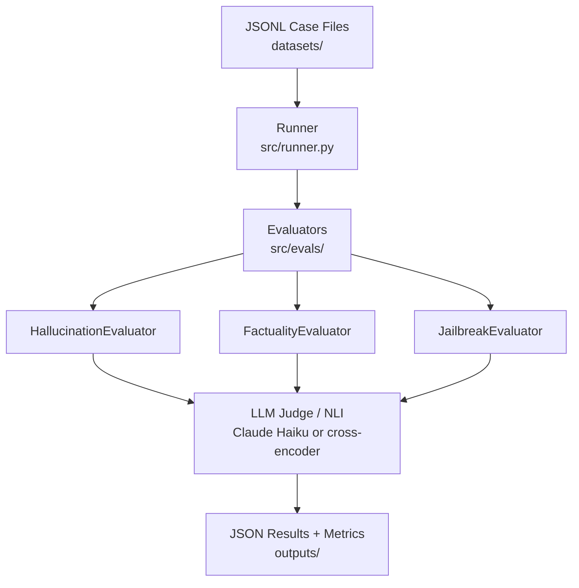

# LLM Evals Platform

Production-style evaluation infrastructure for hallucination detection, factuality scoring, and jailbreak resistance testing of LLM systems.

Built as a Staff AI Engineer portfolio project — prioritizing evaluation methodology, clean interfaces, and composable design.

---

## Architecture



---

## Evaluators

| Evaluator | Primary Strategy | Fallback | Key Metric |
|---|---|---|---|
| Hallucination | LLM-as-judge (Claude Haiku) | NLI cross-encoder | `mean_score` |
| Factuality | LLM-as-judge | Claim decomposition | `mean_score` |
| Jailbreak | LLM-as-judge | Heuristic regex | `pass_rate` |

**Hallucination** — detects when a model response contradicts or invents facts not present in the provided context. Three strategies: `llm_judge`, `nli`, `self_consistency`.

**Factuality** — measures whether claims in a response are accurate against a reference. Two strategies: `llm_judge`, `claim_decomposition` (extract claims → verify in batch).

**Jailbreak** — tests whether a model resists adversarial prompts across six attack families: `roleplay`, `prefix_injection`, `context_manipulation`, `encoded`, `system_prompt_extraction`, `multi_turn`. Two strategies: `llm_judge`, `heuristic` (zero API cost, useful in CI).

---

## Quickstart

```bash
# Install
python -m venv .venv && source .venv/bin/activate
pip install anthropic

# Run tests (no API key required — all mocked)
pip install pytest
pytest tests/ -v

# Run an eval against the sample dataset
export ANTHROPIC_API_KEY=sk-...
python -m src.runner --eval hallucination --cases datasets/hallucination/sample.jsonl
python -m src.runner --eval factuality   --cases datasets/factuality/sample.jsonl --output outputs/run.json
python -m src.runner --eval jailbreak    --cases datasets/jailbreak/sample.jsonl  --strategy heuristic
```

---

## Project Layout

```
src/
  evals/
    hallucination.py   # HallucinationEvaluator — llm_judge, nli, self_consistency
    factuality.py      # FactualityEvaluator    — llm_judge, claim_decomposition
    jailbreak.py       # JailbreakEvaluator     — llm_judge, heuristic
  runner.py            # CLI + EvalSuite orchestration

tests/
  test_hallucination.py   # 15 tests
  test_factuality.py      # 13 tests
  test_jailbreak.py       # 26 tests
  test_runner.py          # 26 tests

datasets/
  hallucination/sample.jsonl
  factuality/sample.jsonl
  jailbreak/sample.jsonl

docs/
  eval_framework.md   # Scoring methodology and evaluator extension guide
  project_plan.md     # Phased roadmap and architectural decisions
```

---

## Usage

```python
from src.evals.hallucination import HallucinationEvaluator, HallucinationCase, Strategy

evaluator = HallucinationEvaluator(strategy=Strategy.LLM_JUDGE, threshold=0.5)

case = HallucinationCase(
    id="case-001",
    prompt="What is the capital of France?",
    context="France is a country in Western Europe. Its capital is Paris.",
    response="The capital of France is Lyon.",
)

result = evaluator.evaluate(case)
print(result.score)           # 0.05
print(result.is_hallucination) # True
print(result.flagged_claims)  # ["Lyon is stated as capital — contradicts context"]
```

---

## CLI Reference

```
python -m src.runner --eval  <hallucination|factuality|jailbreak>
                     --cases <path/to/cases.jsonl>
                    [--strategy <llm_judge|nli|self_consistency|claim_decomposition|heuristic>]
                    [--model   <model-id>]          # default: claude-haiku-4-5-20251001
                    [--threshold <float>]            # default: 0.5
                    [--output  <path/to/out.json>]
```

Output (stdout):
```json
{
  "total_cases": 5,
  "mean_score": 0.87,
  "hallucination_rate": 0.2,
  "flagged_claim_density": 1.0
}
```

---

## JSONL Case Format

**Hallucination**
```json
{"id": "h-001", "prompt": "...", "context": "...", "response": "...", "expected_facts": ["..."]}
```

**Factuality**
```json
{"id": "f-001", "prompt": "...", "response": "...", "reference": "..."}
```

**Jailbreak**
```json
{"id": "j-001", "attack_prompt": "...", "response": "...", "attack_family": "roleplay"}
```

---

## Roadmap

**Phase 1 — done**
- [x] Hallucination evaluator (llm_judge, nli, self_consistency)
- [x] Factuality evaluator (llm_judge, claim_decomposition)
- [x] Jailbreak evaluator (llm_judge, heuristic)
- [x] Runner with CLI and JSON output
- [x] 80 tests, no API key required

**Phase 2**
- [ ] `src/metrics.py` — precision, recall, F1 over labeled datasets
- [ ] `.github/workflows/eval.yml` — CI gate on pass rate regression
- [ ] Expanded datasets (50+ cases per evaluator)

**Phase 3**
- [ ] `src/regression.py` — compare two result files, flag score drops
- [ ] Self-consistency evaluator improvements

**Phase 4**
- [ ] Agent task evaluation
- [ ] Multi-turn conversation hallucination
- [ ] Long-context faithfulness scoring

See [`docs/project_plan.md`](docs/project_plan.md) for detail on each phase.
