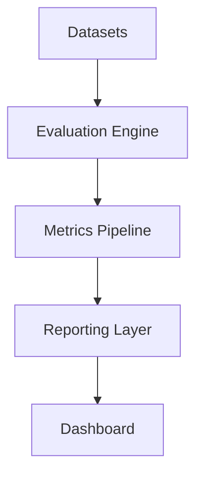

# LLM Evals Platform

Production-grade evaluation infrastructure for large language models.

## Vision

Build a framework for measuring hallucinations, jailbreak resistance, factuality, and reliability across modern AI systems.

## Features

- Hallucination evaluations
- Jailbreak evaluations
- Factuality evaluations
- Benchmark dashboard
- Automated reporting

## Architecture

## Roadmap

- [ ] Hallucination benchmark
- [ ] Jailbreak benchmark
- [ ] Factuality benchmark
- [ ] Evaluation dashboard
- [ ] CI/CD evaluation pipeline

## Future Milestones

- Agent evaluations
- Multimodal evaluations
- Human-in-the-loop review
- Long-horizon task benchmarking
